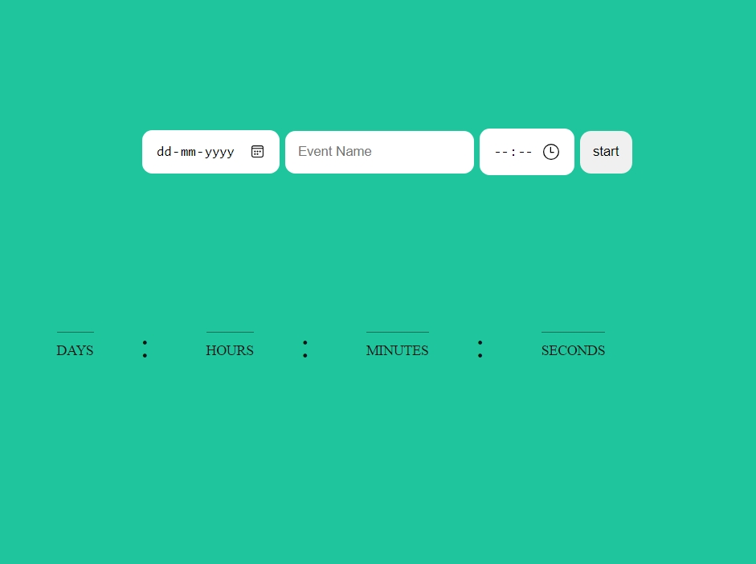
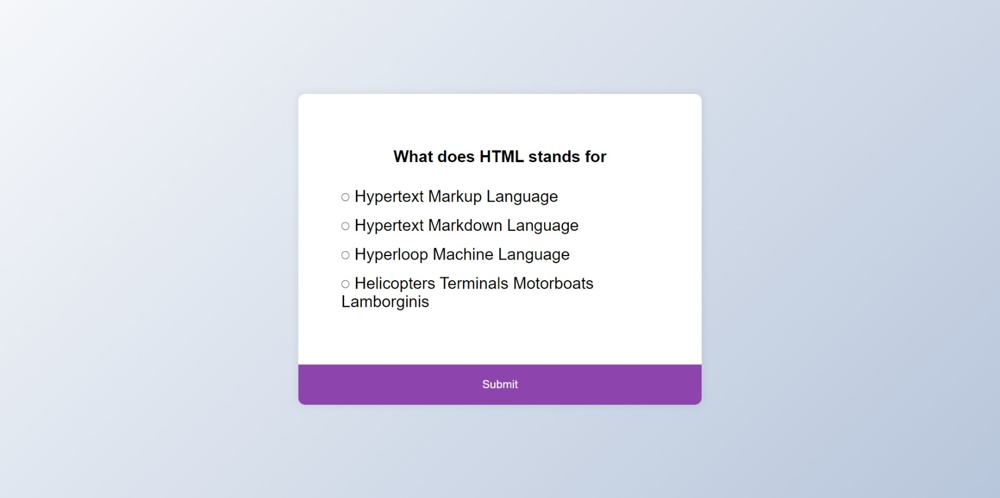
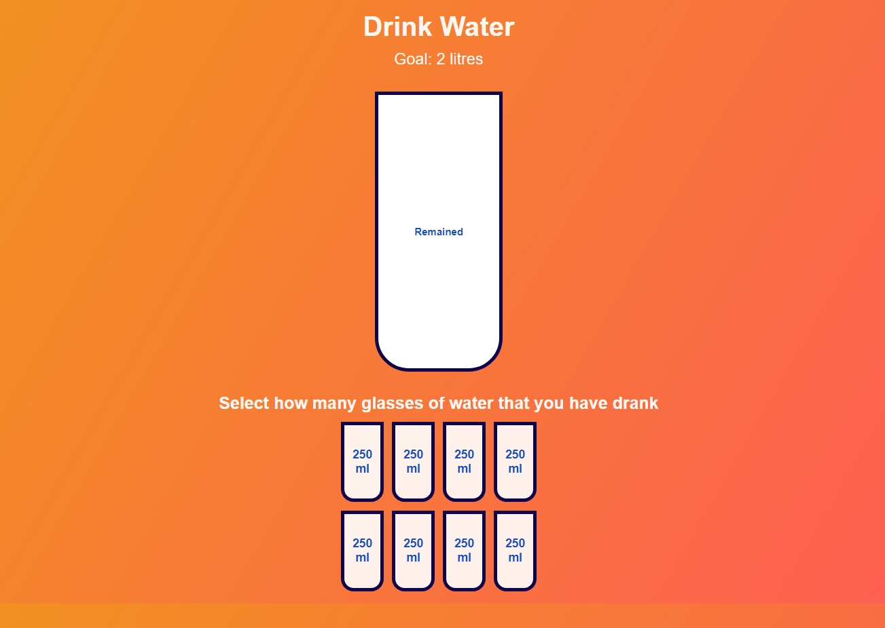
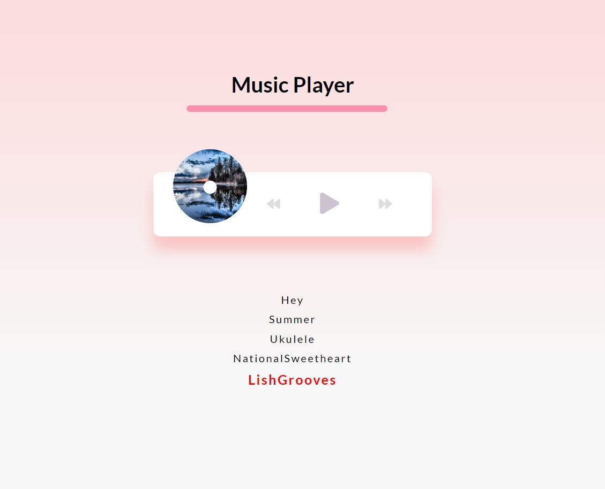

# HTML apps for learning

Product landing page is a landing page for cosmetic products.

<quiz app>A breakdown of java script code of quiz app</quiz>
Data: Stores quiz questions and answers in an array (quizData).
Setup: Finds HTML elements for displaying questions, answers, and buttons.
Variables: Tracks current question index (currentQuizIndex) and score.
Load Quiz: Fills the quiz with the current question and answer choices.
Deselect Answers: Unchecks any previously selected answer.
Get Selected Answer: Checks which answer radio button is selected.
Submit Button Click:
Checks if an answer is selected.
If selected:
Checks if the answer is correct and updates score.
Moves to the next question (if there is one).
If no more questions:
Displays the final score and a reload button.

javascript projects
-countdwon timer
-rock paper scissor
-decimal to binary number
-binary to decimal number

 <!-- project 01 -->

      

        

          
        

        

          <h3 class="title-project">Demo input form</h3>

          

            Demo input form ui using HTML and CSS
          

        

        

          <strong>Click</strong> on the image to see the demo
        

      

    <!-- project 02 -->
    

      

        
      

      

        <h3 class="title-project">Todo app UI</h3>

        

          Todo app ui using HTML and CSS
        

      

      

        <strong>Click</strong> on the image to see the demo
      

    

    <!-- project 03 -->
    

      

        
      

      

        <h3 class="title-project">3d social media icons ui</h3>

        

        3d social media icons using HTML and CSS
        

      

      

        <strong>Click</strong> on the image to see the demo
      

    

    <!-- project 04 -->
    

      

        
      

      

        <h3 class="title-project">Binary to Decimal coonverter</h3>

        

          Binary to Decimal coonverter using HTML, CSS and javascript
        

      

      

        <strong>Click</strong> on the image to see the demo
      

    

    <!-- project 05 -->
    

      

        
      

      

        <h3 class="title-project">Border Radius previewer</h3>

        

          Border Radius previewer using HTML, CSS and javascript.
        

      

      

        <strong>Click</strong> on the image to see the demo
      

    

    <!-- project 06 -->
    

      

        
      

      

        <h3 class="title-project">color cycle</h3>

        

          color cycle using HTML and CSS
        

      

      

        <strong>Click</strong> on the image to see the demo
      

    

    <!-- project 07 -->
    

      

        
      

      

        <h3 class="title-project">Countdown Timer</h3>

        

          Countdown Timer using HTML,CSS and javascript
        

      

      

        <strong>Click</strong> on the image to see the demo
      

    

    <!-- project 08 -->
    

      

        
      

      

        <h3 class="title-project">Decimal to binary converter</h3>

        

          Decimal to binary converter using HTML,CSS and javascript
        

      

      

        <strong>Click</strong> on the image to see the demo
      

    

    <!-- project 09 -->
    

      

        
      

      

        <h3 class="title-project">Decimal to Roman Number Converter</h3>

        

          Decimal to Roman Number Converter using HTML,CSS and javascript.
        

      

      

        <strong>Click</strong> on the image to see the demo
      

    

    <!-- project 10 -->
    

      

        
      

      

        <h3 class="title-project">Expanding Cards</h3>

        

          Expanding Cards using HTML and CSS
        

      

      

        <strong>Click</strong> on the image to see the demo
      

    

    <!-- project 11 -->
    

      

        
      

      

        <h3 class="title-project">Palindrome</h3>

        

          Palindrome project using HTML,CSS and javascript.
        

      

      

        <strong>Click</strong> on the image to see the demo
      

    

    <!-- project 12 -->
    

      

        
      

      

        <h3 class="title-project">Quiz app</h3>

        

          Quiz app ui using HTML,CSS and javascript.
        

      

      

        <strong>Click</strong> on the image to see the demo
      

    

    <!-- project 13 -->
    

      

        
      

      

        <h3 class="title-project">Random joke generator ui</h3>

        

       Random jokes using HTML and CSS
        

      

      

        <strong>Click</strong> on the image to see the demo
      

    

    <!-- project 14 -->
    

      

        
      

      

        <h3 class="title-project">RAndom numbers generator</h3>

        

          RAndom numbers generator using HTML, CSS and javascript
        

      

      

        <strong>Click</strong> on the image to see the demo
      

    

    <!-- project 15 -->
    

      

        
      

      

        <h3 class="title-project">Rock paper scissors game</h3>

        

          Rock paper scissors game using HTML, CSS and javascript.
        

      

      

        <strong>Click</strong> on the image to see the demo
      

    

    <!-- project 16 -->
    

      

        
      

      

        <h3 class="title-project">scroll Animation</h3>

        

         Scroll Animation using HTML and CSS
        

      

      

        <strong>Click</strong> on the image to see the demo
      

    

    <!-- project 17 -->
    

      

        
      

      

        <h3 class="title-project">slider design</h3>

        

         slider design using HTML,CSS and javascript
        

      

      

        <strong>Click</strong> on the image to see the demo
      

    

    <!-- project 18 -->
    

      

        
      

      

        <h3 class="title-project">StopWatch timer</h3>

        

          StopWatch timer using HTML,CSS and javascript
        

      

      

        <strong>Click</strong> on the image to see the demo
      

    

    <!-- project 19 -->
    

      

        
      

      

        <h3 class="title-project">Word Frequency counter</h3>

        

          Word Frequency counter using HTML,CSS and javascript.
        

      

      

        <strong>Click</strong> on the image to see the demo
      

    

    <!-- project 20 -->
    

      

        
      

      

        <h3 class="title-project">Slider Background</h3>

        

          Slider Background using HTML and CSS
        

      

      

        <strong>Click</strong> on the image to see the demo
      

    

   <!-- project 21 -->
   

    

      
    

    

      <h3 class="title-project">Notes app</h3>

      

        Notes App using HTML CSS,javascript
      

    

    

      <strong>Click</strong> on the image to see the demo
    

  

 
  <!-- project 22 -->
  

    

      
    

    

      <h3 class="title-project">emoji maker</h3>

      

        emoji maker using HTML,CSS and javascript
      

    

    

      <strong>Click</strong> on the image to see the demo
    

  

  
   <!-- project 23 -->
   

    

      
    

    

      <h3 class="title-project">Drink water</h3>

      

        Drink water using HTML,CSS and javascript
      

    

    

      <strong>Click</strong> on the image to see the demo
    

  

   <!-- project 24 -->
   

    

      
    

    

      <h3 class="title-project">emoji maker</h3>

      

        emoji maker using HTML,CSS and javascript
      

    

    

      <strong>Click</strong> on the image to see the demo
    

  

   <!-- project 25 -->
   

    

      
    

    

      <h3 class="title-project">meal finder</h3>

      

        meal finder using HTML,CSS and javascript
      

    

    

      <strong>Click</strong> on the image to see the demo
    

